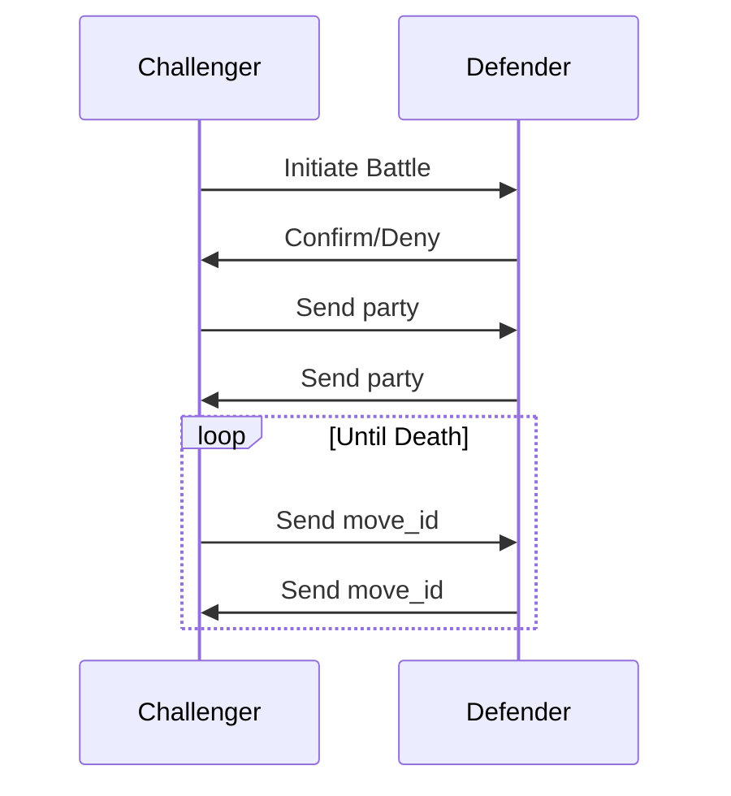

%% Notes on the wireless protocol used %%
# Battle Communication

# API
## Common
Every request will start with a two byte header, the command code and the remaining length of the packet, both as unsigned bytes.

## Challenge

This is the request/response for the initial challenge, which potentially initiates combat.
### Request:
| Bytes | Contents         |
| ----- | ---------------- |
| 0 - 9 | Challenger Name  |
| 10 -  | Challenger Party |
### Response:
Two options, either command code `CHALLENGE_DECLINE` with no packet, or `CHALLENGE_ACCEPT` with this response:

| Bytes | Contents       |
| ----- | -------------- |
| 0 - 9 | Defender Name  |
| 10 -  | Defender Party |
