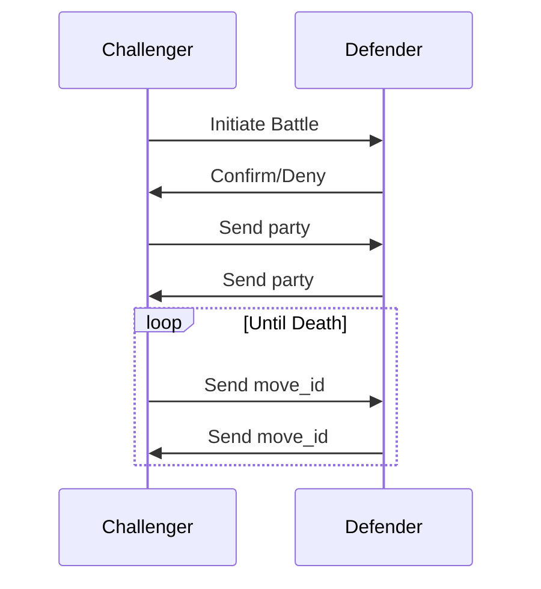

%% Notes on the wireless protocol used %%
# Battle Communication

```mermaid
sequenceDiagram
	participant C as Challenger
	participant D as Defender
	C->>D: Initiate Battle
	D->>C: Confirm/Deny
	C->>D: Send party
	D->>C: Send party
	loop Until Death
		C ->> D: Send move_id
		D ->> C: Send move_id
	end
	

```

# Notes
