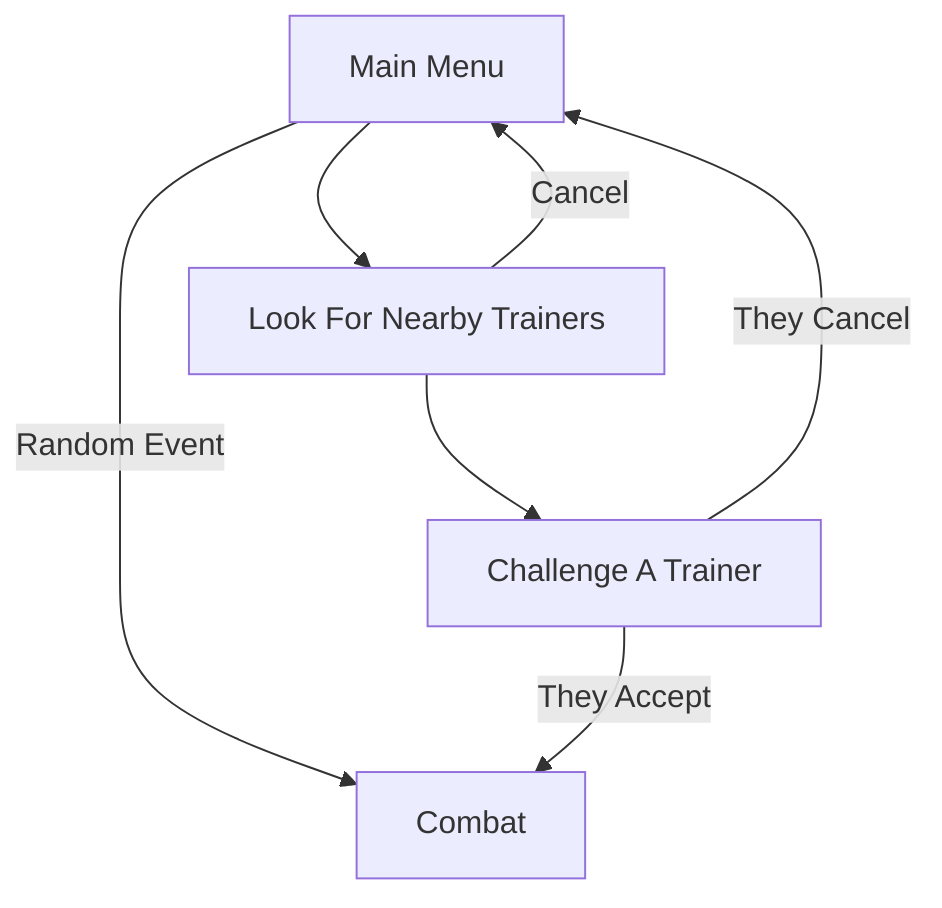

%% Notes on the user interface %%
# Basic Combat Flow

```mermaid
flowchart TD
	MAIN[Main Menu] --> SEARCH
	MAIN --> |Random Event|BATTLE
	
	SEARCH[Look For Nearby Trainers] --> CHALLENGE
	SEARCH --> |Cancel|MAIN
	
	CHALLENGE[Challenge A Trainer] --> |They Accept|BATTLE
	CHALLENGE --> |They Cancel|MAIN
	
	BATTLE[Combat]

```
